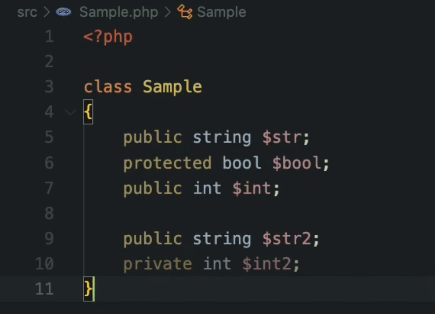

# PHP-CS-Fixer customization rule for Aligning vertical of class properties.

[](https://github.com/takutakuaoao/php-cs-fixer-align-property-rule/releases/tag/)
[](LICENSE)


This is the customization rule for the [PHP CS Fixer](https://github.com/PHP-CS-Fixer/PHP-CS-Fixer).

By using the rule, You can align vertical positions of class properties.

## Demo




## Installation

- Using composer: `composer required-dev takutakuaoao/php-cs-fixer-align-property-rule`

## Usage

In .php-cs-fixer.dist.php file, You need to add this rule.

```php
<?php

use PhpCsFixerAlignPropertyRule\AlignClassPropertiesFixer;

$config = new PhpCsFixer\Config();

return $config
    ->registerCustomFixers([
        AlignClassPropertiesFixer::init(), // add
    ])
    ->setRules([
        ...,
        'Takutakuaoao/align_class_properties' => true, // add
    ]);
```

## Issues

We have obviously not tested this on every website. If you run into an issue, or find a way the automatic detection could be better, please [create an Issue](https://github.com/takutakuaoao/php-cs-fixer-align-property-rule/issues/new). If you can include a test case, that's even better.
